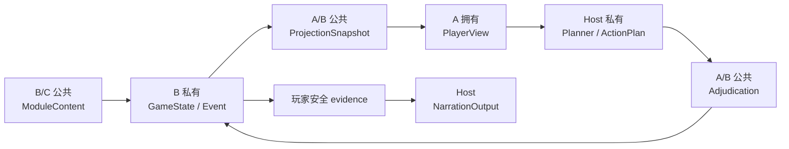

# 数据模型设计

状态：**现行**
适用范围：`agent-collaboration-framework`  
架构决议：[`architecture.md`](architecture.md)

模型事实源按以下顺序解释：Pydantic 模型、Protocol、生成的 JSON Schema、本文。文档与代码
冲突时，以 Pydantic 和生成 Schema 为准，并在同一变更中修正文档。

## 1. 分层与所有权

| 模型组 | 所有者 | 关键禁止项 |
|---|---|---|
| `ModuleContent` 与声明式 Specs | B/C | 运行时状态、骰点、Prompt |
| `ProjectionSnapshot` / `PlayerView` | A/B | 模组秘密、完整 Event、写命令 |
| `TurnPlanningContext` / ActionPlan Run | Host | Keeper capability、数据库 session、未来步骤效果 |
| Adjudication request/result | A/B | 模型直接提交权威状态 |
| `GameState` / Event / execution records | B | 玩家输出、Host Prompt |
| `NarrationOutput` | Host | 未提交事实、Keeper-only 内容 |

所有跨边界模型继承 `ContractModel`，默认 `extra="forbid"`、`frozen=True`、
`populate_by_name=True` 和 `str_strip_whitespace=True`。结构化模型候选始终是不可信 JSON，必须
经过 parser、scope 校验和 Engine 校验，不能直接成为状态写入。

## 2. 输入与安全投影

`PlayerInput` 的 `room_id/player_id/actor_id` 来自可信连接与房间绑定；
`client_action_id` 是客户端幂等键，`utterance` 是自由语言输入。Engine 在提交时仍复核身份。

`ProjectionSnapshot` 是 B 通过只读端口提供的去密快照；`PlayerViewProjector` 将它转换为
`PlayerView`。两者都绑定同一 room/player/actor/revision，包含当前 Actor、场景、公开出口、
已知地点、背包、世界时间、已知信息和可信规则候选，但不包含完整 `GameState`、秘密状态、
其他玩家私有文本或完整模组。

`KeeperCapabilityView` 不进入 semantic Planner。它只进入无模型、无写入的有限前置条件投影
和当前步骤 adjudicator，可以提供 Canon/Runtime information、location、entity、ending 与
world profile 的受控词汇，但不直接授权任何效果。Engine 必须基于提交时的同一 runtime
snapshot 重新校验每个引用。

## 3. 当前 Host 模型

### 3.1 Planner

`TurnPlanningContext` 包含可信 `player_input`、精简 `planning_view`、`recent_history`、
玩家安全的 `memories` / `conversation_summary` 和冻结 `policy`。构造时强制校验：

- input/view 的 room、player、actor 完全相同；
- RecentHistory 属于相同 room/viewer/revision；
- memory 与 conversation summary 不得跨 room/player；
- 模型中没有 Keeper capability、规则候选、效果、检定、目标 ID 或持久意图字段。

Provider 的候选直接按 `ActionPlan` schema 校验；单一目标也是一个 step。`ActionPlan` 的每个
step 只保存 `kind`、`semantic_goal` 与可选安全进度标签，不保存未来效果、隐藏信息、目标 ID
或 revision。灰度期间 legacy 桶仍保留 `HostAgentContext` / `HostTurnDecisionParser`；通过发布
窗口后删除，不作为 semantic Planner 的兼容回退。

### 3.2 ActionPlan persistence

`ActionPlanRun` 保存 plan 身份、parent action/fingerprint、room/player/actor、创建 revision、
冻结 policy、run version、当前 step、状态、lease、取消键和时间戳。`ActionPlanStepRun` 保存
稳定 step/request id、当前状态、source revision、当前步骤冻结裁决、player-safe execution、
pending request、安全失败码和 retry count。

`ActionPlanStepContext` 只包含当前 step、最新 PlayerView、原始 PlayerInput 和已完成步骤摘要。
`ActionPlanPolicy` 冻结技术上限、单次软推进窗口和修复预算。Run Store 使用 CAS 与 lease，
确保多 worker 恢复不会重复提交同一步。

### 3.3 Narration and history

`ActionPlanNarrationContext` 只携带已提交 execution/evidence、当前 PlayerView、安全历史，
以及 `addressing_mode` / `acting_character_name`。多人房用角色名叙述行动者，单人房仍可用
第二人称。`ActionPlanNarrationOutput` 最终映射为 `NarrationOutput`。后者的
`kind/text/claimed_fact_ids/suggested_actions` 会经过 evidence、主体所有权、协议残留和文本
policy 校验；`named_actor` 下引号外的「你/您」同样是 `subject_ownership`。

`OpeningNarrationContext` 只用于开场，包含安全场景、参与者、背景与同一套
`addressing_mode`；它不会伪造行动结果。

`RecentTurnContext` 由 room、viewer、as-of revision 和若干 `RecentTurn` 构成。其他玩家回合
只能投影公共原话和公共叙事；私有结果、完整 Event、状态变化和 Keeper 信息不得进入历史。

## 4. Adjudication 与权威提交

当前 Host 将 `ActionAdjudication` 交给 `AdjudicationExecutor`。Engine 校验身份、source
revision、target、rule decision、roll/pending boundary 和 effect，然后原子提交状态与 Event。
Host 只能消费 player-safe execution 与 evidence。

legacy `Intent`、`ActionRequest` 和 `ActionResult` 仍保留：它们用于既有 Engine API、SQL
`ActionExecution` 记录、`find_completed_action()` 和表达式兼容读取。保留这些 Python 模型不
意味着它们仍是当前 Host 模型入口，也不要求 exporter 发布独立 Host API Schema。

同一 request id 的合法重放必须保持首次 resolution、outcome、visible facts、constraints 和
Event refs，不重新执行规则或追加 Event。当前返回的 view revision 可以推进，但缓存中的
`EngineExecutionResult.state_version` 保持首次提交版本。同一幂等键若换 room/player/actor、
input fingerprint、语义命令或骰点，必须 fail closed。

## 5. Engine 内部模型

`GameState` 是房间权威状态，包含场景、阶段、Actor、实体、公开状态键、世界时间、发现事实、
Runtime 地点/实体、知识、背包实例、RuleAgenda 和结局状态。它不会直接进入 Host Prompt 或
WebSocket。

`RuntimeTimeTask` 与 `TimePointOccurrence` 是离散时间线的运行时部分（#245 §5）。
`time_occurrences` 只保存**临时** occurrence：默认点每天都会来一次，从
`ModuleContent.time_policy` 现推即可，存一份等于把模组内容复制进房间状态，换版本时
必然漂移。任务绑到 occurrence 而不是绑到时刻，因为同日同小时的多个任务共享同一个
occurrence——取消其中一个不该动其他任务，也不该动那个点。

`StateChange`、`StateModifiedPayload` 与 `StateModifiedEvent` 是 B 的审计模型。
`EngineExecutionResult` 保存安全 action result、确认事实、状态变化、完整 Event 和原始状态
版本；A 只能获得其安全投影。

`EngineRuntimeSnapshot` 是事务加载的 module version、完整 ModuleContent、GameState 与
revision。`CompletedAction` 保存首次 request/execution，供幂等和 legacy SQL reader 使用。
提交必须保证 expected revision、Event sequence、状态、Event 与完成记录原子一致。

## 6. ModuleContent 发布模型

`ModuleContentV3` 是 C 发布、B 执行的跨成员协议，也是仓库里唯一的模组内容版本
（v1/v2 已随 #384 删除）。顶层包含 module/version/world_ref、background、Canon 世界节点
（`information`、`entities`、`locations`、`location_edges`）、`rules`、核心解决与结局
（`core_resolution`、`ending_policy`、`ending_anchors`），以及 `presentation`、
`initial_state`、`world_profile`、`time_policy`。

`opening_text` 保存默认公共开场原文，`opening_key_facts` 保存从同一原文提取的公开关键事实提醒。事实清单可缺省，缺省序列化不增加空字段；非空清单必须有原文。开场模型可按原意改写，清单不构成运行时效果或自动语义完整性证明。

`Rule` 是确定性触发声明而非自然语言匹配器：`agent_match` 规则给 Agent 一份不透明的候选菜单，
`event` 规则匹配已提交的领域事件。规则里的谓词、步骤与效果都只能引用登记表里注册过的名字，
在发布期校验（见 `module/validation_v3.py` 与 `registry/`）。所有引用在发布时验证，运行时仍由
Engine 复核。

`ModulePresentation` 是面向玩家的发布元信息——标题、简介、人数区间、难度、时长、导入分页——
与 schema 版本无关，房间列表与建卡前的导入页读的就是它。

模组 `background` 可以进入安全 Planner/Opening 上下文，但不能因此确认未发现事实。具体叙事
claim 仍必须来自当前可见事实或已提交 evidence。

## 7. 传输与 Schema 边界

Framework 发布 `TurnPlanningContext`、灰度期 `HostAgentContext`、ActionPlan/Adjudication、
Opening、Narration、RecentHistory、PlayerView 和 Module Schema。backend 的 WebSocket DTO、
REST DTO 和 `trpg-sdk` 生成类型有独立事实源；Framework Host 内部模型不能替代或自动改写
传输协议。

## 8. 当前模型字段索引

本节用于架构漂移测试，字段名与 Pydantic `model_fields` 保持同步。

- `PlayerInput`: `room_id`, `player_id`, `actor_id`, `client_action_id`, `utterance`, `interlocutor_id`, `interlocutor_name`
- `ProjectionSnapshot`: `room_id`, `player_id`, `actor_id`, `background`, `scene_id`, `phase`, `revision`, `self_actor`, `scene`, `location_context`, `known_locations`, `inventory`, `world`, `known_information`, `checkpoint_options`
- `PlayerView`: `room_id`, `player_id`, `actor_id`, `background`, `scene_id`, `phase`, `revision`, `self_actor`, `scene`, `location_context`, `known_locations`, `inventory`, `world`, `known_information`, `checkpoint_options`
- `Intent`: `kind`, `verb`, `target`, `check`, `approach`, `declarations`, `initiated_by_target`, `summary`, `clarification_question`
- `ActionRequest`: `request_id`, `room_id`, `player_id`, `actor_id`, `source_view_revision`, `input_fingerprint`, `intent`, `roll_value`
- `ActionResult`: `request_id`, `action_id`, `resolution`, `outcome`, `check_result`, `visible_facts`, `narration_constraints`, `view_revision`, `event_refs`
- `NarrationOutput`: `kind`, `text`, `claimed_fact_ids`, `suggested_actions`
- `TurnPlanningContext`: `player_input`, `planning_view`, `recent_history`, `memories`, `conversation_summary`, `policy`
- `HostAgentContext`: `player_input`, `player_view`, `recent_history`, `memories`, `conversation_summary`, `keeper_capabilities`
- `ActorState`: `player_id`, `name`, `source_character_id`, `source_character_version`, `state`, `resources`, `conditions`, `condition_states`
- `GameState`: `room_id`, `scene_id`, `phase`, `ending_id`, `event_sequence`, `actors`, `entities`, `public_entity_state_keys`, `world_time`, `discovered_facts`, `actor_discovered_facts`, `runtime_locations`, `runtime_entities`, `visibility_overrides`, `party_location_knowledge`, `actor_location_knowledge`, `actor_position_contexts`, `item_instances`, `party_item_knowledge`, `actor_item_knowledge`, `rule_agendas`, `time_occurrences`, `time_tasks`, `core_resolved`, `ending_available`, `ending_resolution`
- `StateChange`: `path`, `from_value`, `to`, `cause`
- `StateModifiedPayload`: `path`, `from_value`, `to`
- `StateModifiedEvent`: `event_id`, `sequence`, `type`, `room_id`, `actor_id`, `client_action_id`, `cause`, `visibility`, `payload`
- `EngineExecutionResult`: `action_result`, `confirmed_facts`, `state_changes`, `events`, `state_version`
- `EngineRuntimeSnapshot`: `module_id`, `module_version`, `module_content`, `game_state`, `revision`
- `CompletedAction`: `request`, `execution`
- `ModulePresentation`: `title`, `name_en`, `synopsis`, `players_min`, `players_max`, `difficulty`, `estimated_duration`, `story_label`, `subtitle`, `authors`, `tags`, `player_intro_pages`
- `ModuleContentV3`: `content_schema_version`, `module_id`, `version`, `world_ref`, `background`, `opening_text`, `opening_key_facts`, `information`, `knowledge_goals`, `entities`, `locations`, `location_edges`, `rules`, `core_resolution`, `ending_policy`, `ending_anchors`, `presentation`, `initial_state`, `world_profile`, `time_policy`

## 9. 变更规则

1. 新增玩家可见字段前必须检查秘密、其他玩家私有数据和 Keeper 信息泄漏。
2. ActionPlan/Run 字段变化必须同时验证恢复、CAS、lease、取消和 pending boundary。
3. Engine 模型变化必须保持 legacy execution record 的读取兼容，除非另有显式迁移方案。
4. 发布模型变化必须重跑 Framework exporter；backend DTO 和 SDK 只在其事实源变化时重生成。
5. Narration 字段或 policy 变化必须验证 Opening、ActionPlan、WebSocket delivery、广播和分句。
