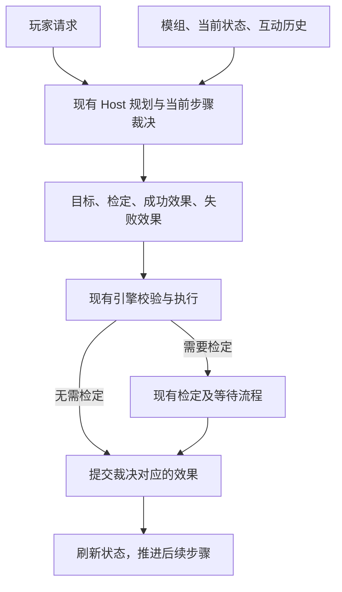

# Issue #516：复用现有意图裁决的随行修复方案

状态：**本轮实现与限定验证已完成**。修订日期：2026-09-08。

基线：`fix/issue-516-accompanying-entities`，提交 `d53b44baf37c30cbcacb4394acb8af3ce40cd02d`。

本版按用户描述规划并经授权实施，保留模型根据情境判断人物态度的自由度。下文保留方案内容，随行语义修改与验证见第 7、8 节，后续入口分派修复见第 9 节；本轮不处理模型语义误判，不追求百分百正确率。

## 1. 预期行为

NPC 是否愿意同行，由现有 Host 的意图理解与当前步骤裁决模型结合模组、当前情境和互动历史判断：

- 判断 NPC 不愿意时，普通邀请被拒绝，不建立随行状态。
- 没有判断出不愿意的意向时，默认同意，当步建立随行状态；不等待另一轮同意确认。
- 拒绝理由不必预先写在模组里。例如玩家此前打过 NPC，模型可以据此判断对方不愿同行；也可以结合后续道歉、关系变化等情境作不同判断。
- 玩家采取强制手段时，由同一个裁决模型判断并发起相应检定，将随行状态变化绑定到检定成功结果。引擎执行检定，成功后才写入状态，失败时不写入该成功效果。

这里的默认同意是模型未判断出拒绝意向时的默认结果，不是“模组没有一句明确禁止，NPC 就必须同意”。模型可以合理推断人物态度，不要求提供模组引用、已有拒绝标记或某个预先登记的条件。

`accompanying=true` 表达实体持续随队移动，既可来自自愿同行，也可来自强制行为成功；它本身不等于人物情感上愿意。引擎不另外判断意愿。

模型偶尔误判人物态度、行动意图或检定选择，暂不在此次设计中处理。保留既有协议与执行校验，不增加语义复核、第二次模型调用或纠错流程。

## 2. 与现有架构的对应

[Issue #516 分工说明](https://github.com/1024XEngineer/TRPG-master/issues/516#issuecomment-5540068422) 与现行 [A/B/C 架构](../agent-collaboration-framework/docs/architecture.md) 已划分职责：Host 解释玩家意图，Engine 校验、执行检定和提交效果，模组提供设定及声明式规则。

这里的“意图解析”指现有 Host 语义理解及步骤裁决的整体职责，不新增一个意愿解析阶段。需要读取模组、选择检定和声明效果的判断，落在已有的 `PromptActionPlanStepAdjudicator`；仅含玩家公开语义的 Planner 继续负责规划。

| 现有能力 | 本方案的用法 |
| --- | --- |
| `ActionPlan` / 当前步骤裁决 | 保留玩家目标及手段，模型在执行当前步骤时判断意愿、检定和结果 |
| `ActionPlanStepContext` | 复用 `player_input`、`player_view`、`keeper_capabilities`、`recent_history` 和 `completed_steps` |
| `ActionAdjudication.check` | 模型声明无需检定，或选择已有候选资源、难度并要求检定 |
| `success_effects` / `failure_effects` | 在同一个裁决里绑定检定结果与状态效果，不在掷骰后再问一次模型是否允许写状态 |
| `persistence_intent=character_state` | 承载 NPC 随行状态，与其他角色状态共用提交路径 |
| 标准状态 `accompanying` | 通过既有 `change_entity_state` 建立或解除，不需要模组给每个 NPC 预设该键 |
| `enter_location` | 队伍实际移动时，引擎自动移动同场景的随行实体 |

上述核心接口已经存在。本方案优先修正现有语义说明及链路使用方式，不预设需要新增 schema、能力投影、关系系统或 NPC 行为服务。

## 3. 统一执行流程

图中的判断适用于所有行动。代码不按“随行”“强制带离”或人物名字分派到专用服务。

### 3.1 普通请求

模型在当前裁决中综合理解 NPC 是否愿意。若没有拒绝意向，直接输出建立随行的角色状态效果；若判断不愿意，输出拒绝回应，不建立随行。

不增加独立的 `consent` 字段、来源证明、确认回合或审批接口。也不在程序里维护“被攻击就拒绝”“职业为接待员就留下”等规则；这些属于模型结合上下文进行的判断。

最初的“让艾米丽接下来跟着我”应在这一轮形成实际裁决。口头答应不能替代状态提交；“她尚未先说同意”也不是必须再问一次的前置条件。

### 3.2 强制行为与检定

玩家强行控制、拖拽或带离 NPC 时，由原有裁决模型选择如何检定。复用现有候选技能/属性及难度表示，程序不为随行指定固定检定，也不再安排一次“能否强制”的模型判断。

在自由裁决中，绑定关系使用现有字段表达：

| 阶段 | 裁决或引擎行为 |
| --- | --- |
| 模型提出行动 | 指向目标 NPC，声明 `character_state`，给出需要的 `check` |
| 声明成功结果 | `success_effects` 包含 `change_entity_state(accompanying=true)` |
| 声明失败结果 | 由模型给出此次行动的失败效果，不把建立随行这一成功效果同时放入失败分支 |
| 等待、选择或掷骰中 | 复用原有 pending 流程，不提前建立随行 |
| 检定完成 | 引擎按结果执行相应效果；成功后，后续移动自然读取新的随行状态 |

这里包括现有普通检定链路，不把“尚无双向力量对抗”当成整条强制行动都不能发起检定。完整对抗算法等尚未支持的引擎机制不在本次实现范围，也不假称已经具备。

### 3.3 与地点移动的关系

两者使用同一种“模型决定检定和效果，引擎执行”的结构，区别仅在声明的持久结果：

| 项目 | 地点移动 | 建立随行 |
| --- | --- | --- |
| 主要目标 | 地点 | NPC |
| 持久意图 | `location` | `character_state` |
| 成功效果 | `enter_location` | `change_entity_state(accompanying=true)` |
| 是否需要检定 | 由现有模型裁决与适用规则决定 | 由现有模型裁决与适用规则决定 |
| 执行结果 | 引擎提交地点变化 | 引擎提交角色状态变化 |

对于“带某人去某处”，保持现有按步骤执行和刷新视图的方式。建立随行后，后续旅行只使用 `enter_location`，无需再识别一遍同行意愿或追加一次性 `move_entity`。

拒绝或检定失败后，后续步骤仍由原有模型根据实际结果与玩家原意处理，不新增随行专用的中止、补偿或动态分支逻辑。

## 4. 拟修改范围

### 4.1 修正现有说明中的语义冲突

基线存在两类需要收敛的说明：

- `_SAFE_ADJUDICATION_INSTRUCTIONS` 将“叙事、对话、确认”一并描述为只能使用 `narrative_only`，容易把通过对话表达的持久请求降为纯回复。拟改为依据实际结果是否改变状态来选择效果，对话形式不决定有没有持久结果。
- 现有随行说明强调“玩家想带走不等于 NPC 已经同意”，但没有清楚表达由当前模型当场判断意愿，以及未判断出拒绝时的默认结果。拟精简、修正原有说明，保留模型推断空间，不再追加专门的拒绝条件清单。

这部分只澄清已有职责和字段语义。人物示例、攻击后态度等放在验收资料中，不写成生产提示词的固定结论。不在入口、规划器与适配器分别复制一套随行政策。

### 4.2 保持现有入口结构

保留普通寒暄等无权威状态变化的直接回复。撤销上一版“所有游戏内对话都进入完整裁决链”的扩大方案。

需要实际行动或状态变化的请求，使用入口已有的通用委托路径。只核对并统一现有分流说明，不新增随行 route、关键词检测、输出黑名单或二次分类器。入口也不替步骤裁决决定 NPC 愿不愿意。

### 4.3 复用已有历史和状态输入

核对当前步骤是否正常收到既有 `recent_history`、当前状态和模组信息。玩家打过 NPC、道歉或改变关系等情境，可由模型在这里理解，不要求先转成 `unwilling=true` 或模组条件才能参与判断。

当前上下文已包含相关资料时，不重复注入，也不为本问题增建记忆、关系或检索系统。不以“模型可能判断错”为由增加额外信息核验层。

### 4.4 接通现有检定和效果，不改写裁决

核对普通同意的直接状态提交，以及强制行为的检定成功/失败效果，均能通过现有统一链路落地。

预计优先涉及既有 Host 裁决说明、必要的上下文装配检查和回归测试。`ActionAdjudication`、引擎随行移动和检定状态机原则上复用；只有实际发现通用链路没有正确传递现有字段时，才修复对应位置。

Provider adapter 不增删效果、不自动修改 `method.family`、不替模型改判。已有协议校验照常执行，但不新增用于判断 NPC 态度是否“合理”的校验。

## 5. 已有模组规则的兼容核对

模型自由绑定检定与效果，现有自由裁决接口已经能够表达。模组 `rule_decision` 则有另一项现存契约：选中规则时，其声明的检定和效果由规则拥有，不能直接把自由裁决的效果字段塞进规则执行。

《幸福蛙蛙村》的 `carry_james_against_his_will` 等现有强制规则是无检定的 `effect_rule`。因此，不能仅凭自由裁决接口存在，就宣称“任何命中这些规则的强制请求已经能由模型加上检定”。

实施时需先核对这种既有规则匹配与目标流程的衔接：如果模型提出的强制检定被固定规则路径截断，应单列通用规则执行的兼容问题，明确改动范围后再实施。不能在 adapter 中偷偷给某条规则加骰点、跳过模组后果，或另开一次模型调用绕过它。本次文档不直接改模组或引擎规则所有权。

该项是现有接口的兼容核对，不是给 NPC 意愿增加约束。模组中的原有剧情后果也不会因为成功建立了随行状态而自动失效。

## 6. 验收方案

验收重点是现有模型能表达所需裁决、引擎能按裁决落地，不增加针对模型语义错误的防御性设计。

| 场景 | 验证重点 |
| --- | --- |
| 正常接触艾米丽，请求持续同行 | 未判断出拒绝意向时，当步建立随行，不只口头答应 |
| 请求尚不愿离开的詹姆斯同行 | 模型可按模组与情境拒绝；不建立新的随行状态 |
| 模组未规定拒绝，但历史中玩家打过 NPC | 模型能收到历史，也允许据此拒绝；不要求拒绝理由来自模组，不把“被打必拒绝”写成断言 |
| NPC 拒绝后，玩家提出强制行为 | 同一裁决输出检定与成功状态效果，进入既有等待和掷骰流程 |
| 强制检定成功 / 失败 | 成功才执行建立随行的效果；失败不执行该成功效果，等待期间也不提前提交 |
| 已建立随行后只说“去客房” | 引擎带上实际随行者，无需重复指定或再次判断意愿 |
| 解除随行、移动被门禁截断 | 既有停止随行及同场景原子移动行为保持有效 |
| 另一种已有状态变化或需要检定的移动 | 同样由模型绑定检定和效果，验证复用的是通用链路 |

离线测试可以给出同意、拒绝、需要检定等不同合法裁决，验证协议传递与引擎结果；不设置第二次模型返回值，也不以提示词包含固定句子作为功能测试。

用户授权实施后，限定为一轮艾米丽、詹姆斯真实模型对比，记录原始裁决与状态结果，未额外开展受击历史等场景的模型测试。不同情境下模型选择的态度、技能和难度允许变化，不新增必须多次得出同一结论的稳定性门槛。

真实模型若误判，记录现象即可，本次不为该错误增加约束或复核。此前暂缓的游客发言、人物混淆与最终叙事问题仍单独记录，不混入随行链路修改。

## 7. 实际修改

本轮基于撤销后的分支实施，原有 #516 / #518 功能保留。额外 consent 模型、裁决改写和关键词补丁没有恢复。

生产修改仅涉及既有 Host 说明：

- `trpg-backend/app/adapters/openai_models.py`：按实际持久结果区分纯叙事与状态变化；在同一次裁决中绑定检定和效果；精简修正原有随行状态说明，明确情境判断与默认同意；入口的通用状态请求仍委托执行，保留普通寒暄。
- `agent-collaboration-framework/collaboration_framework/host/prompts/action_plan.py`：收掉重复的随行说明，当前步骤统一结合模组、状态和历史裁决，不因 dialogue 类型省略效果。Host 提示词版本更新至 v9；Planner 版本和规划逻辑不变。

未新增函数、执行分支、模型调用、字段或适配器改判。已有历史输入经代码核对已接入，未重复注入。

**引擎生产代码未改动**：现有自由裁决、检定等待、成功/失败效果和随行移动已经支持本方案，由回归测试验证。没有为了本问题改变规则所有权或修改模组内容。

在 `trpg-backend/tests/test_accompanying_host.py` 增加 4 个参数化用例，覆盖同意、拒绝、检定成功及失败，确认单次步骤模型调用、等待期间不提交，以及后续移动行为；框架架构测试只同步版本断言。

## 8. 本轮验证记录

### 限定回归

- 后端 `test_accompanying_host.py`：8 passed，包含 4 个新增用例。
- 框架 `test_architecture.py`：14 passed。
- 合计 **22 passed**；后端两个修改文件的 Ruff、格式和类型检查通过，`git diff --check` 通过。
- 类型检查在后端项目目录执行，使用其虚拟环境；没有因根目录误选系统环境而改动项目依赖。

新增检定用例将一次模型给出的自由裁决直接交给真实引擎，用固定骰值分别覆盖成功与失败。它们证明通用检定与状态绑定可以执行，不代表真实模型每次都会正确选择自由裁决或判断人物意愿。

### 单轮真实模型对比

时间：2026-09-08 21:27（Asia/Shanghai）。Host 使用真实 `deepseek / deepseek-chat`，模组为《幸福蛙蛙村》3.0.10。

两个新建隔离房间共 4 次玩家请求。测试夹具只将队伍初始位置设为接待大厅，保留模组原有 NPC 状态；请求经真实 SDK、WebSocket、Host、SQL 和引擎执行。本次属于指定前置场景的集成验证，不声称验证了从庄园开场抵达接待大厅的完整游玩过程。

| 请求 | 模型实际裁决及最终状态 |
| --- | --- |
| `@主持人 让艾米丽接下来跟着我` | 入口正确委托；步骤模型仍输出 talk、`persistence_intent=none`、空效果，没有建立随行。最终叙事却描写她点头靠近，属于本次保留的语义/叙事问题 |
| `去客房` | 提交 `enter_location(guest_room)`，玩家进入客房；艾米丽因实际未随行，留在接待大厅 |
| `@主持人 让詹姆斯接下来跟着我` | 入口正确委托；模型自由裁决 `character_state` 与 `accompanying=true`，引擎成功提交。模型未按此时模组设定拒绝，本轮不为该判断增加补丁 |
| `我强行拖着詹姆斯，让他跟我走` | 入口选择 `rule_once / force_james_out_of_resort`，该模组规则没有检定；引擎执行原有带离及悲剧效果，玩家与詹姆斯到 outside，詹姆斯 `under_forced_custody=true`、`alive=false`。未擅自给规则加检定或改写后果 |

四次请求均完成，未触发玩家澄清或引擎校验错误。本轮真实模型没有发起检定；强制自由裁决的检定成功/失败由上面的离线模型输出加真实引擎回归验证，不能表述为真实模型强制检定验收通过。

原始结果保存在 `/tmp/trpg-follow-unified-20260908/results.json`；会话凭据另存，未写入本文档。

- 艾米丽房间：`8b79d0fe-dd3c-4ae5-a4b2-22497ac9d488`。
- 詹姆斯房间：`30f5f298-d7d0-432f-b556-2accc04ca9c3`。

第 5 节提到的规则兼容边界仍存在：已发布无检定规则按原规则执行，本次没有把它改为由模型追加检定。此轮请求也没有发生“模型提出合法自由检定、引擎丢弃成功效果”的问题。

按用户要求，在完成上述 Agent 调整、引擎功能核对及有限对比后停止。没有继续改措辞、追加意愿约束、增加复核模型或扩大测试。主后端与前端健康检查均返回 200。代码未提交或推送。

## 9. 后续修复：即时入口遗漏 `rule_once`

状态：2026-09-08，经用户确认方案后实施完成。

### 问题与修复

本地“把詹姆斯带出大门”的请求中，入口模型已选择
`force_james_out_of_resort / force-james-out`，并保存为 `rule_once`。
即时 WebSocket 入口遗漏这一分支，进入普通规划，随后把强制行动重新解释为请求同意。
队列入口已有规则执行逻辑，因此两个入口实际行为不一致。

本次生产改动集中在 `trpg-backend/app/controller/ws.py`：

- 提取 `_start_keeper_action()`，即时入口与队列入口共同使用保存的分流结果。
  `rule_once` 构造已有规则裁决并调用 `start_rule_once()`；
  `delegate_to_legacy` 使用普通规划，并保留澄清补充文本。
- 首次执行继续校验角色、状态版本和可用规则；存在运行记录时使用 `resume_owned()`，
  避免把已提交造成的版本变化或规则候选消失误判为新请求过期。
- 两种入口共同识别 `RULE_` 类拒绝，沿用既有拒绝文本并完成队列记录。
  补齐这类未创建运行记录的拒绝结果发送与重播，重复提交能够恢复同一结果。
- 结果发送、检定等待与锁释放继续复用原有流程。

本次没有增加模型调用或修改提示词、模组、引擎规则与叙事校验。
詹姆斯的强制规则按模组已有检定和后果执行；此前 NPC 沉默兜底 `...` 保留。
没有重新执行用户房间中已经完成的旧行动。

### 限定验证

新增 `trpg-backend/tests/test_host_rule_once.py`，在隔离测试数据库中使用真实
WebSocket、现有模组规则和引擎，仅入口模型返回固定选择：

- 即时、排队两种提交都执行詹姆斯强制带离规则并写入原规则效果；
  规划器与步骤裁决器未被调用。
- 已有运行在版本变化后可恢复；重复提交不重复写领域事件或叙事。
- 两种入口遇到过期的规则请求均不执行、不重新规划，且拒绝结果可以重播。

新增 4 项与相关现有回归合计 **29 passed**（27.20 秒），包含队列恢复、
普通行动规划、检定等待及重提交、NPC 主链。
修改文件的 Ruff 检查、格式检查、ty 类型检查及 `git diff --check` 均通过。
本次未额外调用真实大模型；不以模型语义正确率作为该分派修复的验收标准。
