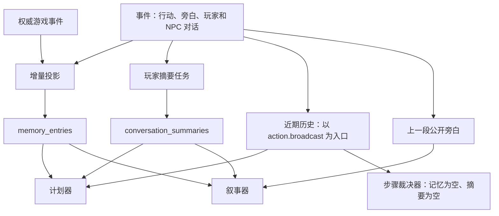

# 记忆链路完整性检查报告（2026-09-11）

检查基线：`27e203e`（`fix(narration): preserve companions and keep dialogue narration concise`）。此前的随行身份、对话旁白和验证文档已提交。本次只增加检查报告；没有修改业务代码、迁移或仓库测试，没有写入实际游戏库，也没有调用外部模型。

## 结论

当前链路能保存并检索部分人物对白，能将记忆与玩家摘要送入计划器和叙事器，但尚不能保证共同经历、旁听内容和裁决上下文完整延续。问题涉及事件投影、上下文交接、摘要和增量读取，单靠调整叙事提示不能覆盖。

优先处理三类确定问题：

1. 合法长消息可能卡住房间的记忆投影，导致后续读取持续返回空记忆。
2. 步骤裁决器没有收到长期记忆或摘要；它依赖的近期历史又不收录结构化 NPC 对话。
3. 随行、共同移动及 NPC 旁听等经历没有完整关联到相应人物，跨场景检索会遗漏。

这不改变上一轮现场结论：詹姆斯到达蛙鸣泉时，检索能返回“你带我出来的时候……”的回答，公开状态也有 `accompanying=true`。那次初遇描写已有足够上下文可避免；本报告发现的其他问题不能全部归因到那一次输出上。

## 检查方法与范围

- 静态追踪当前主链路：WebSocket 事件写入 → 增量记忆投影 → 受众及实体筛选 → 计划 / 步骤裁决 / 叙事模型输入 → NPC 跟进对白 → 玩家摘要任务。
- 只读检查实际房间 `4b149bf8…`、revision 39，以及此前的历史数据库副本。
- 运行现有记忆、近期历史、跨场景叙事和 NPC 对话测试：**27 项通过**。
- 在 `/tmp` 创建 **11 组隔离场景，记录 13 项诊断结果**，使用真实投影、查询和模型适配器配合本地捕获客户端。检查预期是复现现存问题，不是验证问题已经修复。
- 实际房间没有保存完整模型请求体。现场记忆入选结论来自历史状态重放；合成场景中的模型交接则直接捕获了适配器传出的 JSON。

## 当前数据流

当前世界状态通过 `PlayerView` / Keeper 能力视图另行进入主链路。记忆缺失不等于引擎状态被清空；人物是否正在随行、物品由谁持有等当前事实仍应以引擎为准。

一次隔离完整回合的实测输入如下。测试数据库事先包含一条人物记忆和一份玩家摘要：

| 消费方 | 记忆条数 | 玩家摘要 | 近期历史 |
| --- | ---: | --- | --- |
| 安全计划器 `trpg_turn_plan` | 1 | 有 | 有该字段 |
| 步骤裁决器 `trpg_action_plan_step_adjudication` | **0** | **无** | 有该字段 |
| 叙事器 `trpg_action_plan_narration` | 1 | 有 | 无完整近期回合字段；另外提供上一段旁白 |

“有近期历史字段”不表示其中必有对话；只有结构化 NPC 对话的另一组样例中，它返回 0 个回合。

## 已确认问题

### F1 · P1：合法长对白会让整个房间的记忆读取持续降级

**触发：** 玩家向 NPC 发送 2000 字消息，长度符合聊天及对话输入上限。

**原因：** `_listener_memories()` 在原话前后添加说话者、听众和“在场并听到”的说明，生成内容超过 `MemoryEntry.content` 的 2000 字上限，触发 `ValidationError`。候选记忆在同一批投影中构造，异常使事务回滚、游标不推进。每次读取都先补投影，随后又撞到同一条消息；应用层捕获异常后返回空 `MemoryContext`，连已经保存的旧记忆也不返回。

**复现：** 先保存一条正常记忆，再添加长对白和一条后续正常对白。连续两次读取均抛出 `ValidationError`；应用封装返回 0 条；数据库仍只有此前的 1 条记忆。换成短的后续输入不能解除这个状态。

**影响：** 单条合法消息可持续影响该房间计划器、叙事器的记忆与摘要读取。这是确定性故障，不是模型幻觉。当前詹姆斯案例日志未见这一错误。

**位置：** [消息上限](../trpg-backend/app/dto/ws.py#L181)、[听众记忆构造](../trpg-backend/app/adapters/sqlalchemy_memory.py#L130)、[先投影再读取](../trpg-backend/app/adapters/sqlalchemy_memory.py#L513)、[读取降级](../trpg-backend/app/core/action_plan_turn.py#L2414)。

### F2 · P1：步骤裁决的记忆交接没有接通，近期对话也存在空缺

**原因一：** `ActionPlanStepContext` 声明了 `memories`、`conversation_summary`，但 `_freeze_current_adjudication()` 构造它时没有赋值。`_ModelStepAdjudicator` 和模型适配器继续原样传递。后端 `_read_keeper_memory_context()` 虽然存在，当前主链没有调用它。

**原因二：** `SqlAlchemyRecentHistorySource.read()` 只用 `action.broadcast` 建立回合，再关联旁白及检定。当前 `@NPC` 原话写为 `dialogue.player`，NPC 回复写为 `dialogue.npc`；两者均不能建立近期回合。即使同次有 `narration.push`，也不会单独入选。

**复现：** 完整模型输入捕获结果见上表。另一组“玩家询问能否带路 → NPC 答应 → 旁白点头”的样例，近期回合返回 0 条；仅 `latest_published_narration()` 能拿到“他点头答应”，没有实际问答。

**影响：** 计划模型可能知道之前的承诺，负责当前步骤软判断的模型却没有直接得到这些记忆。计划的简短目标不能保证代替原始经历；关系、承诺、威胁后再行动等场景尤其容易丢失语境。

**位置：** [步骤上下文构造](../agent-collaboration-framework/collaboration_framework/host/application/action_plan_orchestrator.py#L957)、[默认空字段](../agent-collaboration-framework/collaboration_framework/host/schemas/action_plan.py#L391)、[近期历史入口](../trpg-backend/app/adapters/sqlalchemy_recent_history.py#L198)、[未接入的 Keeper 读取方法](../trpg-backend/app/core/action_plan_turn.py#L2462)。

### F3 · P1：人物共同经历的投影和关联不完整

存在三个相关断点：

| 来源 | 当前行为 | 跨场景后果 |
| --- | --- | --- |
| NPC A 说话，NPC B 已被记录为听众 | 基础记忆只关联事件说话者；`listener_ids` 虽保留，查询不用于实体关联；听众投影只处理玩家发言 | A 能检索到自己的台词，B 检索不到亲耳听过的内容 |
| 旁白描述“玩家和某 NPC 一起离开” | 参与者只取事件的 `player_id` / `actor_id`；旁白事件没有结构化记录共同经历的 NPC | 地点变化后，按人物检索会排除这段旁白 |
| `entity.state_changed`、`entity.moved` 等权威事件 | payload 没有展示文本时退回 `cause`；人物关联只记录行动 Actor | 得到 `adjudication:...`，又被检索过滤，未形成可用的共同经历 |

**复现：** NPC A 发言、B 为明确听众，移动到新地点后 A 返回 1 条、B 返回 0 条。“一起离开”旁白跨场景返回 0 条。随行状态及移动事件各投影一条原因串，查询返回 0 条。

**实际房间：** revision 39 共 39 条游戏事件，其中 33 条公开；已投影的这 33 条全部只有 `adjudication:...` 内容。其余 3 条 private、3 条 hidden 没有进入这条公开记忆投影，属于现有范围限制。公开当前状态、已知信息和当前回合证据仍有其他输入渠道，不能据此说所有权威事实都从模型输入消失了。

**附带缺口：** 该房间的 `check.result` 只有技能、骰值、成功等级等结构化字段，没有 `_text()` 支持的展示字段，因此没有形成检定记忆。对话摘要同样只得到空文本，不能直接解释这次检定经历。

**影响：** 系统目前更容易记住“某人说过一句话”，难以完整记住“哪些人一起做过什么”。不能用解析旁白中的人名来替代权威事件和结构化参与者关联。

**位置：** [基础与听众投影](../trpg-backend/app/adapters/sqlalchemy_memory.py#L84)、[权威事件投影](../trpg-backend/app/adapters/sqlalchemy_memory.py#L179)、[实体关联条件](../trpg-backend/app/adapters/sqlalchemy_memory.py#L594)、[NPC 回复听众记录](../trpg-backend/app/service/npc_dialogue.py#L417)。

### F4 · P2：摘要会丢失人物归属，而且不能稳定填补首次换场景的空缺

**语义输入缺失：** 摘要服务最终只发送 `{id, text, type}`，未传入说话者、听众、场景、来源版本；调用中的 `source_revision` 固定为 `None`。NPC 说“我答应带路”时，摘要器没有这条事件的结构化身份信息，只能依赖正文或此前摘要猜是谁。来源事件 ID 虽能用于人工追溯，当前摘要器没有沿 ID 回查事件的工具。

**首次换场景不触发：** `scene_changed` 依赖上一份成功摘要的游标。还没有摘要时，这个条件恒为假，必须等满 10 条事件或 6000 字，或显式强制触发。

**复现：** 四条短事件从旧场景跨到新场景，正常入队没有生成摘要任务；强制入队后可以正常处理。捕获摘要输入时，事件确实只有上述三个字段。

**跟进台词顺序：** 完成回合先创建摘要入队任务，再执行 `after_narration` 持久化 NPC 回复；两者可能竞争。若入队先完成，本轮最后的 NPC 台词需等后续触发才能进入摘要。此项由调用顺序确认，未进行并发概率测试。

**位置：** [首次触发条件](../trpg-backend/app/service/conversation_summary.py#L231)、[实际摘要输入](../trpg-backend/app/service/conversation_summary.py#L389)、[回合回调顺序](../trpg-backend/app/controller/ws.py#L2173)。

### F5 · P2：较早创建、较晚提交的事件可能永久越过增量游标

记忆增量扫描按 `(created_at, event_id)` 前进。若一个事务先创建事件、稍后才提交，而另一个较新事件已经被投影并推进游标，前者便落在高水位后面，之后的普通增量读取不再扫描它。

**复现：** 先投影时间戳 20 的事件，再插入时间戳 19 的事件。增量扫描 0 条，检索只有 1 条；在隔离库全量重建后恢复为 2 条。相同时间戳下 UUID 排序落后于游标也有同类条件。

现有并发测试验证了去重和游标不倒退，没有验证晚提交事件的遗漏。摘要同样使用事件时间复合游标，具备相同结构性风险；本次直接复现的是记忆投影。

**位置：** [增量事件筛选](../trpg-backend/app/adapters/sqlalchemy_memory.py#L273)、[摘要事件游标](../trpg-backend/app/service/conversation_summary.py#L54)。

### F6 · P2：记忆读取的 revision 参数没有形成历史读取边界

`read_npc_context()` 的 `revision` 最终只写入返回值 `as_of_revision`。查询不按来源版本或回合边界限制记忆，读取前还会投影当前所有新事件；摘要也直接取最新记录。

**复现：** 请求 revision 2，仍返回 revision 8 的对白和 revision 8 的摘要。

**影响条件：** 普通串行回合读取最新状态时通常不显现；旧回合恢复、延迟叙事或并发读取时，返回值标注的版本不能保证其内容与该版本一致。不能将当前 `as_of_revision` 当作快照保证。

**位置：** [记忆查询与结果构造](../trpg-backend/app/adapters/sqlalchemy_memory.py#L513)。

### F7 · P1（受众记录缺失时）：场景限定事件可能被当作公开记忆

`scene_scoped` 事件通过 `EventAudience` 冻结玩家受众。投影将基础记忆的 visibility 写成 `public`，依赖 `audience_player_ids` 再收窄；但缺少受众行时得到空数组，查询把空数组解释成“不限制受众”。

**复现：** 同一组数据中，有冻结受众的场景事件和玩家专属事件都正确阻止了另一名玩家读取；唯独缺少受众记录的 `scene_scoped` 事件被另一名玩家检索到。

**范围：** 正常对话写入在一个事务内保存事件与受众，当前詹姆斯房间也没有发现缺少受众的场景事件。这是历史导入、异常数据或其他不完整写入路径下的确定边界缺陷，不是已证实该房间发生了越权读取。

**位置：** [场景事件受众投影](../trpg-backend/app/adapters/sqlalchemy_memory.py#L336)、[空受众判断和查询](../trpg-backend/app/adapters/sqlalchemy_memory.py#L551)。

### F8 · P2：预算裁剪存在不可恢复的正文尾部丢失和长期事实被挤出

- `_text()` 与摘要 `_event_text()` 都只取正文前 2000 字。2006 字旁白中，末尾 6 字关键事实同时从记忆和摘要输入消失；摘要成功推进游标后，后续增量摘要不会重新处理该尾部。原始事件仍在数据库里。
- 默认最多返回 12 条 / 4000 字；排序将 `experienced/heard`、对话放在普通 `confirmed` 事实之前。复现中 12 条旧闲聊挤掉了更新的已确认事实，尽管后者文本很短。查询最多先选 36 个候选，之后才做字数裁剪。
- 限制预算本身是必要的，但当前实现没有保证共同经历或新近重要事实在预算内有位置。长期保留的原始数据与当轮实际可用上下文应分开评估。

**位置：** [正文截断](../trpg-backend/app/adapters/sqlalchemy_memory.py#L75)、[记忆排序和预算](../trpg-backend/app/adapters/sqlalchemy_memory.py#L609)、[摘要正文截断](../trpg-backend/app/service/conversation_summary.py#L81)。

## 需要区分的设计边界

### 玩家可读记忆与 NPC 自己知道的事情尚未分离

当前 `read_npc_context` 实际提供的是“当前玩家有权读取、与地点或人物相关”的上下文，不是严格按单个 NPC 认知筛选的记忆：

- 同地点记忆可以入选，无须证明被指定 NPC 听过或经历过。本地样例中，一个没有听众依据的 NPC 也能拿到该地点过去的发言。
- 叙事器将所有当前可见 NPC 的相关记忆放进一份共享输入，仍由模型区分谁知道什么。
- 一份摘要属于玩家，未按 NPC 分离，也没有逐句保留听众与认知来源。
- 另一名玩家未参与过的 NPC 经历可能被玩家受众过滤，这是当前玩家安全边界；不能简单删除受众限制来让 NPC“记起所有事情”。

后续 agent 要选择上下文时，应分别表达玩家可读权限、NPC 自身经历以及权威世界状态；保留现有玩家安全查询入口，避免把房间级 Keeper 记忆直接交给公共叙事。

### 当前实际房间的摘要缺失仍需运行时定位

发生蛙鸣泉叙事之前，房间已有 20 条事件；检查时该玩家没有任何摘要任务或摘要记录。按当前代码的事件数量门槛，这些历史应能达到入队条件；不能只用 F4 的“首次摘要未满门槛”解释这次现场缺失。

现有代码包含服务启动、后台入队和工作循环；其他房间也有已完成摘要，日志曾记录真实摘要生成。该房间的缺失究竟来自当时的部署版本、回调未到达、成员状态还是任务执行，现有日志不足以确定。本次没有在实际房间强制入队或生成摘要。

后续定位需要记录入队是否执行、跳过原因、玩家范围、摘要游标及任务状态。记忆查询也宜记录入选数量、来源 ID、降级所属房间 / 回合；无需记录完整提示或私密正文。

此外，摘要 `_run()` 未隔离 `process_once()` 在数据库读取、历史摘要解析等阶段的异常；该部分异常发生在模型调用的重试保护之外，可能终止工作循环。这里是静态风险，未做真实数据库故障注入，也未据此判定本次现场原因。

## 已验证正常的部分

| 环节 | 结论与范围 |
| --- | --- |
| NPC 自己说过的话 | 正常写入 `dialogue.npc` 后能投影，按 NPC ID 跨场景检索；詹姆斯历史重放返回 2 条、94 字符 |
| 玩家对明确听众说话 | 有 `listenerIds` 时会生成听众的亲历记录；长消息例外见 F1 |
| 正常受众和玩家隔离 | 非空冻结受众、正常玩家专属事件、房间范围均有过滤与既有回归覆盖；异常空受众见 F7 |
| 记忆到计划 / 叙事模型 | 两者实际序列化保留记忆及摘要，没有只存在于 Python 对象的问题 |
| 当前随行状态 | `PlayerView` 保留公开状态，已提交的随行名单提示由当前可见 NPC 派生，不依赖历史猜测 |
| 增量去重和重建 | 重复投影幂等；隔离重建能补回游标遗漏，不改变原始事件；晚提交遗漏见 F5 |
| 摘要基本处理 | 强制入队、增量处理和保存能够工作，既有租约及游标测试通过；不等于每个实际回合都已触发 |

当前本地读取到的近期历史配置为 6 个回合 / 6000 字；字段本身另有单项裁剪。某次日志中的 `character_count=800` 是实际返回量，不能当作配置上限或 NPC 记忆入选证据。

## 建议的修复依赖顺序（本次未实施）

1. **先恢复可靠读取与权限边界：** 处理 F1 的超长投影和整批降级，明确空受众语义；确保单条异常不会让该房间的已有记忆全部不可用。
2. **补齐结构化经历：** 在现有事件投影里处理权威移动、关系变化、检定及实际听众，分别保留说话者、参与者、亲历者和来源。叙事只是表达，不能自动升级成权威事实。
3. **接通消费链路：** 让近期历史覆盖当前实际使用的对话事件；为步骤裁决接入适当作用域的记忆 / 摘要；保留计划、Keeper 和玩家叙事之间的权限区别。
4. **完善摘要与读取边界：** 摘要携带人物、地点及来源信息，覆盖首次换场景与最后一条 NPC 回复；同时处理晚提交事件、回合读取边界及预算保留策略。
5. **为后续 #421 保留统一读取契约：** agent 可以决定本轮取哪些经历，但事件关联、受众、游标和文本保存必须先可靠；更换上下文选择者无法找回从未正确投影或已被截掉的内容。

现有重建脚本只能按现有规则重新投影：可以补回部分游标遗漏，不能自动修正人物关联、原因串或长消息故障。因此本次未对实际房间执行重建。

## 复核材料

- 既有测试：`trpg-backend/tests/test_memory_system.py`、`test_recent_history.py`、`test_narration_npc_memory.py`、`test_npc_dialogue.py`；合计 27 项通过。
- 隔离诊断脚本：`/tmp/trpg-memory-integrity-audit-20260911/audit_probes.py`。
- 诊断结果：`/tmp/trpg-memory-integrity-audit-20260911/probe-results.json`。
- 回归日志：`/tmp/trpg-memory-integrity-audit-20260911/regression.log`。
- 模型交接及复现日志：`/tmp/trpg-memory-integrity-audit-20260911/probes-complete.log`。
- 先前詹姆斯历史重放：[随行及对话旁白评估](companion-dialogue-narration-evaluation-20260911.md#补充核查换场景时的-npc-记忆)。
